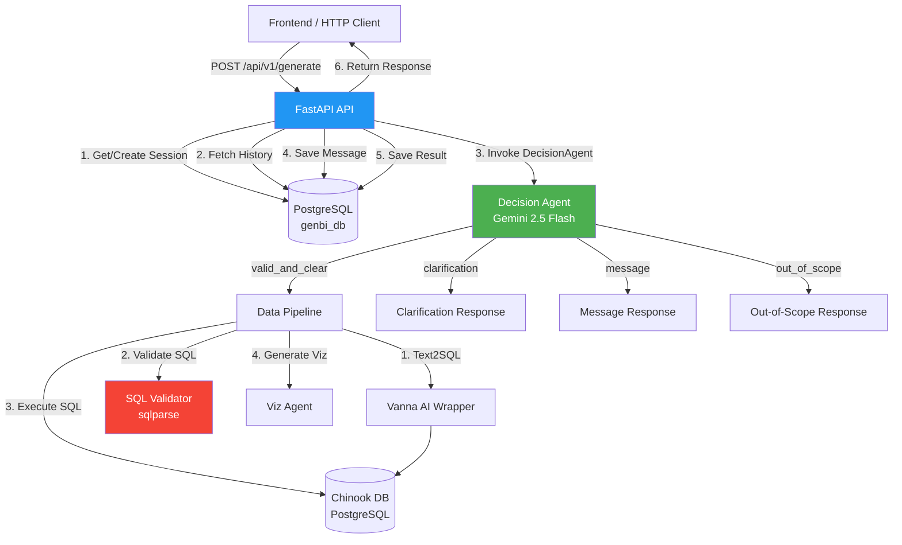

# Implementation Plan: Agente Decisor y API de Orquestación para Gen BI

**Branch**: `TFG-13-crear-agente-decisor` | **Date**: 2026-03-23 | **Spec**: [spec.md](./spec.md)
**Input**: Feature specification from `/specs/TFG-13-crear-agente-decisor/spec.md`

## Summary

Implementar el agente decisor que orquesta la generación de dashboards a través de lenguaje natural, clasificando intenciones del usuario mediante Gemini 2.5 Flash y coordinando Vanna AI (text2sql) con el agente de visualización existente. Complementariamente, construir la API REST con FastAPI que exponga el pipeline al frontend, con persistencia de sesiones, historial conversacional y resultados en PostgreSQL.

## Technical Context

**Language/Version**: Python ≥ 3.11
**Primary Dependencies**: FastAPI, SQLAlchemy 2.0 (async), asyncpg, google-genai, Pydantic v2, pydantic-settings, sqlparse, structlog, Alembic, uvicorn
**Storage**: PostgreSQL (BD de persistencia para sessions/messages/results — separada de la fuente de datos)
**Testing**: pytest + pytest-cov + pytest-mock
**Target Platform**: Linux/macOS server (entorno local Sprint 2)
**Project Type**: Web service (API REST) + agent modules
**Performance Goals**: Pipeline completo < 15s (p90), 5 requests concurrentes (NFR-001, NFR-002)
**Constraints**: Sin autenticación este sprint. Solo SELECT contra la base de datos de origen. Ventana de contexto = 5 mensajes.
**Scale/Scope**: Entorno local de desarrollo, ~30 consultas de prueba end-to-end (SC-005)

## Constitution Check

*GATE: Must pass before Phase 0 research. Re-check after Phase 1 design.*

### Pre-Design Check ✅

| Principle | Status | Notes |
|---|---|---|
| I. Agent-First Architecture | ✅ PASS | `decision_agent/` y `vanna_agent/` como directorios independientes, entry-points propios, sin importar FastAPI |
| II. Single-Responsibility | ✅ PASS | decision_agent: clasificar + orquestar. viz_agent: visualizar. vanna_agent: text2sql. Cada uno con una sola responsabilidad |
| III. Sandbox Code Execution | ✅ PASS | El decision_agent no ejecuta código generado; delega a viz_agent que ya tiene sandbox. SQL se valida con allowlist |
| IV. Fail-Fast & Descriptive Errors | ✅ PASS | Custom exceptions + structlog + error payloads con `error_type`, `message`, `context` |
| V. Python Code Standards | ✅ PASS | ruff, mypy, type hints, Pydantic v2, uv |
| VI. Design Patterns & SOLID | ✅ PASS | Protocol classes para agentes, Dependency Inversion en el Agent, Strategy para routing |
| VII. Testing Strategy | ✅ PASS | pytest + conftest + unit (mocked LLM) + integration (real Gemini) + examples/ smoke test |

### Post-Design Re-Check ✅

| Principle | Status | Notes |
|---|---|---|
| I. Agent-First Architecture | ✅ PASS | decision_agent y vanna_agent tienen `examples/` como smoke test standalone |
| II. Single-Responsibility | ✅ PASS | API solo rutea HTTP hacia los servicios inyectados |
| III. Sandbox Code Execution | ✅ PASS | SQL validation layer (`sqlparse`) como barrera obligatoria antes de toda ejecución |
| IV. Fail-Fast & Descriptive Errors | ✅ PASS | Exception hierarchy: `AgentError` → `SQLValidationError`, `LLMError`, `PipelineError` |
| V. Python Code Standards | ✅ PASS | Config via Pydantic `BaseSettings`, no `os.getenv()` sueltos |
| VI. Design Patterns & SOLID | ✅ PASS | Protocols: `Text2SQLAgent`, `VizAgentProtocol`, `DecisionAgentProtocol` |
| VII. Testing Strategy | ✅ PASS | Tests plan: `tests/conftest.py`, `test_classifier.py`, `test_sql_validator.py`, `test_agent.py` |

## Project Structure

### Documentation (this feature)

```text
specs/TFG-13-crear-agente-decisor/
├── spec.md              # Feature specification
├── plan.md              # This file
├── research.md          # Phase 0 output - technical research
├── data-model.md        # Phase 1 output - entity definitions
├── quickstart.md        # Phase 1 output - setup guide
├── contracts/
│   └── api-v1.md        # Phase 1 output - API contracts
└── tasks.md             # Phase 2 output (via /speckit.tasks)
```

### Source Code (repository root)

```text
backend/
├── decision_agent/                    # NUEVO: Agente decisor (standalone)
│   ├── pyproject.toml                 # Dependencias: google-genai, pydantic, sqlparse, structlog
│   ├── .env.example
│   ├── src/
│   │   └── decision_agent/
│   │       ├── __init__.py
│   │       ├── agent.py               # Entry-point: DecisionAgent.run()
│   │       ├── classifier.py          # IntentClassifier (Gemini structured output)
│   │       ├── sql_validator.py       # SQLValidator (sqlparse, allowlist SELECT)
│   │       ├── models.py             # Pydantic models (Input, Output, IntentClassification)
│   │       ├── config.py             # Config (Pydantic BaseSettings)
│   │       ├── exceptions.py         # Custom exception hierarchy
│   │       ├── logger.py             # Structured logging (structlog)
│   │       └── prompts/
│   │           ├── __init__.py
│   │           ├── classification_prompt.py   # Intent classification prompt
│   │           └── refinement_prompt.py       # Prompt reformulation for retry
│   ├── tests/
│   │   ├── __init__.py
│   │   ├── conftest.py
│   │   ├── test_agent.py
│   │   ├── test_classifier.py
│   │   └── test_sql_validator.py
│   └── examples/
│       └── basic_usage.py             # Console smoke test
│
├── vanna_agent/                       # NUEVO: Wrapper de Vanna AI (standalone)
│   ├── pyproject.toml                 # Dependencias: vanna, pydantic, python-dotenv
│   ├── .env.example
│   ├── src/
│   │   └── vanna_agent/
│   │       ├── __init__.py
│   │       ├── agent.py               # Entry-point: VannaAgent.text_to_sql() / .execute_sql()
│   │       ├── config.py             # Config (Gemini + Chinook connection)
│   │       └── models.py             # Pydantic models (Text2SQLInput, Text2SQLOutput)
│   ├── tests/
│   │   ├── __init__.py
│   │   ├── conftest.py
│   │   └── test_agent.py
│   └── examples/
│       └── basic_usage.py             # Console smoke test
│

├── api/                               # NUEVO: FastAPI REST API
│   ├── pyproject.toml                 # Dependencias: fastapi, uvicorn, sqlalchemy, asyncpg, alembic
│   ├── .env.example
│   ├── src/
│   │   └── api/
│   │       ├── __init__.py
│   │       ├── main.py                # App factory, CORS config, lifespan
│   │       ├── config.py             # API Config (Pydantic BaseSettings, DB URL)
│   │       ├── dependencies.py       # FastAPI dependency injection
│   │       ├── routes/
│   │       │   ├── __init__.py
│   │       │   ├── generate.py        # POST /api/v1/generate
│   │       │   ├── health.py          # GET /api/v1/health
│   │       │   ├── sessions.py        # GET /api/v1/sessions/{id}/history
│   │       │   └── results.py         # GET /api/v1/results/{id}
│   │       ├── models/
│   │       │   ├── __init__.py
│   │       │   ├── database.py        # SQLAlchemy ORM models (Session, Message, Result)
│   │       │   └── schemas.py         # Pydantic request/response schemas
│   │       ├── services/
│   │       │   ├── __init__.py
│   │       │   ├── session_service.py     # Session + message persistence
│   │       │   ├── result_service.py      # Generation result persistence
│   │       │   └── pipeline_service.py    # Orchestration bridge (API → decision_agent)
│   │       └── db/
│   │           ├── __init__.py
│   │           ├── engine.py          # Async engine + session factory
│   │           └── base.py            # SQLAlchemy declarative base
│   ├── alembic/                       # DB migrations
│   │   ├── alembic.ini
│   │   ├── env.py
│   │   └── versions/
│   │       └── 001_initial_schema.py
│   └── tests/
│       ├── __init__.py
│       ├── conftest.py
│       ├── test_generate.py
│       ├── test_health.py
│       ├── test_sessions.py
│       └── test_results.py
│
├── viz_agent/                         # REFACTORIZADO: Modernizado para usar Pydantic Settings
│   ├── src/viz_agent/
│   │   ├── agent.py
│   │   ├── config.py                  # Pydantic Settings unificado
│   │   └── ...
│   └── tests/
│
└── specs/                             # Feature specs
```

**Structure Decision**: Se sigue el patrón Agent-First (Principio I) con el agente en su propio directorio raíz (`decision_agent/`). La API y los agentes son módulos separados para mantener la separación de concerns. El DecisionAgent expone protocolos (Dependency Inversion, Principio VI) para desacoplar a Vanna de la lógica local.

## Architecture Overview



## Component Detail

### Decision Agent (`decision_agent/`)

**Responsibility**: Clasificar intención del usuario y orquestar el pipeline de datos si corresponde.

**Entry-point**: `DecisionAgent.run(input: DecisionAgentInput) -> DecisionAgentOutput`

**Flow interno**:
1. Recibir query + conversation_history
2. Clasificar intención con Gemini (structured output → `IntentClassification`)
3. Según la categoría:
   - `valid_and_clear`: invocar pipeline (Vanna → SQL validation → execute → viz_agent)
   - `valid_but_ambiguous`: generar pregunta de clarificación
   - `out_of_scope`: generar mensaje explicativo
   - `conversational`: generar respuesta amigable
4. Para pipeline: manejar retry (1 vez) si Vanna falla (FR-003)
5. Retornar `DecisionAgentOutput` con `response_type`, datos y metadata

**Dependencias inyectadas** (via Protocol):
- `Text2SQLAgent` → Vanna AI wrapper
- `VizAgentProtocol` → viz_agent wrapper
- `GeminiClient` → Clasificación de intención

### Vanna Agent (`vanna_agent/`)

**Responsibility**: Wrappear la librería Vanna AI existente en una estructura de agente consistente con el resto del proyecto.

**Entry-point**: `VannaAgent.text_to_sql(query: str) -> str` / `VannaAgent.execute_sql(sql: str) -> pd.DataFrame`

**Nota**: Internamente reutiliza la configuración de Vanna v2 usando Gemini (`GeminiLlmService` + `PostgresRunner` + Chinook). No reescribimos Vanna — solo la organizamos como agente standalone.

### API (`api/`)

**Responsibility**: HTTP layer, persistencia de sesiones/mensajes/resultados.

**La API NO contiene lógica de agentes**. Solo:
1. Recibe HTTP request
2. Gestiona sesiones y contexto (BD)
3. Invoca a pipeline_service (Decision Agent)
4. Persiste resultados
5. Retorna HTTP response

### SQL Validator

**Responsibility**: Validar que TODO SQL antes de ejecución sea exclusivamente SELECT.

**Implementación**:
- Parser con `sqlparse`
- Whitelist: solo `SELECT` statements
- Blacklist: `DELETE`, `DROP`, `UPDATE`, `INSERT`, `ALTER`, `TRUNCATE`, `CREATE`, `REPLACE`
- Logging de intentos bloqueados
- No bypassable por diseño (FR-024)

## Complexity Tracking

> No hay violaciones de la constitución que requieran justificación.

| Violation | Why Needed | Simpler Alternative Rejected Because |
|-----------|------------|--------------------------------------|
| — | — | — |
